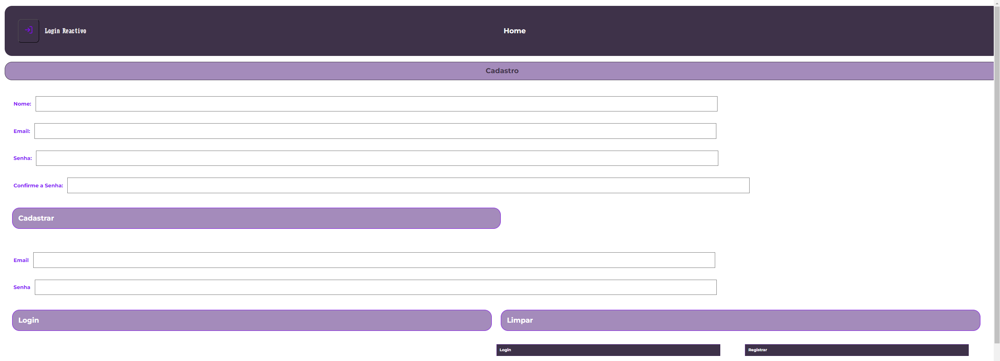
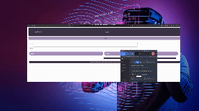

# LOGIN REACTIVO
Projeto desenvolvido para a Campinho Digital, totalmente autoral, com o objetivo de demonstrar como é feita a validação de um token e chave de acesso, utilizando diversas tecnologias.

## Tela Inicial

## Tela de cadastramento de usuário

## Base de dados do MongoDB

### INICIALIZAR O BACKEND
Você deve possuir um usuário master para o banco de dados e o seu password, em um arquivo **dotenv**. Além disso, ter o Node instalado em sua máquina local e configurar o arquivo **conn.js** com seus respectivo usuário e senha, conferindo se está digitado corretamente no arquivo dotenv.

Após verificar isto, executar o comando **npm start** para rodar o servidor.

É necessário ter uma conta no MongoDB para melhor execução e acompanhamento.

### INICIALIZAR O FRONTEND
Com o terminal integrado, selecionar a pasta  **login-project** com o "cd" e utilizar o comando **npm run dev** para rodar a aplicação frontend.

É importante verificar a instalação de todos pacotes necessários.

# TECNOLOGIAS UTILIZADAS

## Node.Js

 
O JavaScript talvez seja uma das principais linguagens de programação utilizadas no mercado, sendo base para inúmeros frameworks e facilmente aderido a comunidade, recebendo atualizações crescentes o que faz de uma linguagem totalmente viva.

O foco do javascript talvez seja o frontend *(client side)*, interpretado diretamente pelo navegador; tornou-se necessário figurar para o backend e é neste momento que surge o NodeJs, que é um ambiente de execução do código do lado servidor no backend *(server side)* com frequentes novos módulos e atualizações de módulos surgindo a todo instante.

## ReactJs

 
O React é um framework também baseado em javascript (ai você compreende a expansão e complexidade da linguagem) criada pelo Facebook (atual Meta) que tem como aplicação criação de interfaces de usuário (UI) em aplicativos web. Altamente escalável e flexível e tem integração direta com o Node.

## Vite

 
Vite (palavra de origem francesa que significa "rápido"), é uma ferramenta de construção de projetos de frontend que se destina a oferecer uma experiência de desenvolvimento mais rápida e leve, para diversos tipos de projeto web. Entre os modelos de projeto suportadas estão: 
- React
- Vue
- Solid
e etc.

Para instalá-lo basta digitar **npm create vite@latest**

## Login Reactivo

